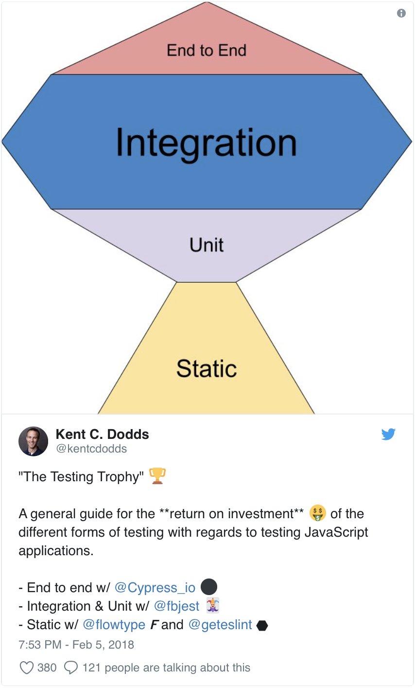

import { Head, Image } from 'mdx-deck'
import { Split, Invert } from 'mdx-deck/layouts'
export { default as theme } from './theme.js'
import { Appear } from 'mdx-deck'

<Head>
  <title>Testing GraphQL</title>
</Head>

export default Invert

# Testing GraphQL
### Jake Dawkins

---

export default Split

 

## Who Am I

- Apollo Architect
- Best practices
- Schema design & Testing

```notes
- Apollo architect: I'm here to help you navigate the graphql ecosystem
- Best practices: we've worked with people/organizations at all sizes
- Schema design to help you prevent costly refactors in the future
```

---

## What I'm Talking About

- The Purpose of Testing
- Effectiveness of Tests
- Testing Clients
- Testing Servers


```notes
```

---

export default Invert

# The Purpose of Testing

---

##  The Purpose of Testing

- Safety of production code
- Documentation

```notes
- prevent regressions in features that haven't been touched in a while
- documentation for you in the future or devs new to the codebase
>>> BUT... not all tests are created equal
```
---

export default Invert

# Effectiveness of tests

```notes
- Pareto principle: 20% of the work can give you 80% of the benefit
- What this talk is going to do is tell you what 20% to focus on when testing graphql apps, to get 80% of the benefit
```

---
export default Invert



```notes 
- If you want tests to bring you more confidence in your code, you should be testing the parts you're least confident with or are most likely to break.
- The parts most likely to break are not the units, but the relationship between them
- For that reason, most of this talk will be focused on equipping you to test these relationships
```

---

export default Invert

# Testing Clients

---

## Static Typing

- Component props 
- Types based off production schema
- `apollo-cli`

```notes
```

---

## Unit Testing

- "Making sure all the pieces are there"
- Translation of props to rendered UI
- `react-testing-library`

```notes
```

---

## Integration testing

- "Making sure the pieces fit together"
- Loading, error, and expected states
- Local state changes (cache updates)
- `MockedProvider`

```notes
```

---

## E2E Testing

- "Making sure the app is usable"
- Authentication headers passed to servers
- Components are visible and accessible
- `cypress.io`

```notes
```
---
export default Invert

# _Demo_ 


```notes
- pages/login: more complicated. Cache writes, interaction
```

---
export default Invert

# Testing Servers

---

## Static Typing

- Type generation is not as easy as it sounds
- Resolvers don't _have_ to return anything
- Default resolvers make this even harder

```notes
- Non-leaf Resolvers can return anything, as long as the resolvers receiving that response know what to do with it
```

---

## Unit Testing

- Leverage GraphQL's dependency injection
- DataSources are just classes
- Resolvers are just functions

```notes
- Use the constructor to pass things your datasources need (ex. store for SQL datasource)
- dep injection: use the context to pass everything that your resolvers need
- this makes your resolvers pure functions
```

---

## Integration Testing

- Testing execution of an operation
- `apollo-server-testing` 🎉 🎉

```notes
- Where resolvers get data, and how they pass it to other resolvers to build a query response
```

---

## E2E Testing

- Checking HTTP semantics
- Making sure a valid request produces a valid response
- Can use real or staging services 


---
export default Invert

# _Demo_ 


```notes
- /dataSources/launch.js
- resolvers/query: first tests (pagination)
- /integration
- /e2e
```

---

> Testing is essential, so it should also be easy and effective.

---
export default Invert

# Thank You!
